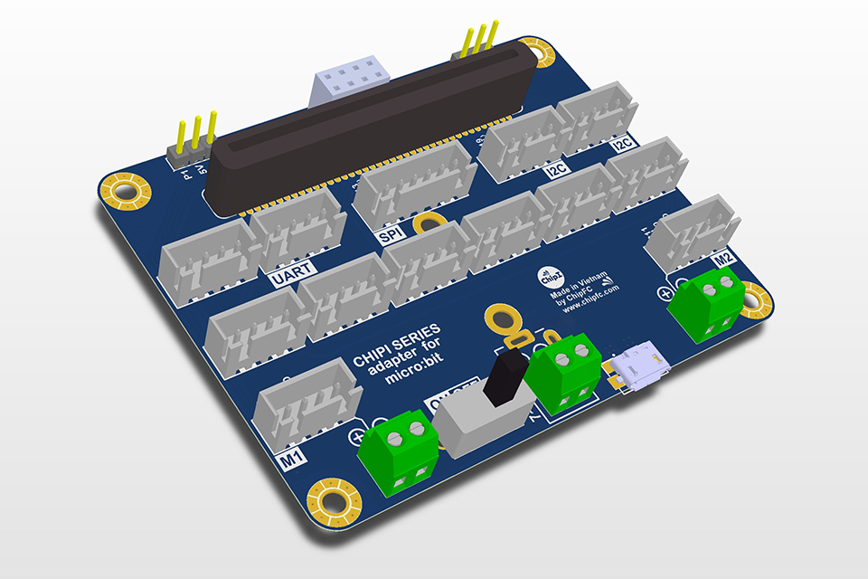

# npnbitkit

## Giới thiệu
- Đây là thư viện dành riêng cho bộ kit Microbit Chipi do NPNLab và ChipFC cùng phối hợp thực hiện.
- Bộ kit này dành cho các chương trình học mở rộng và nâng cao của Microbit để có thể kết nối với các thiết bị ngoại vi phần cứng bên ngoài.

Ủng hộ chúng tôi tại:
- ChipFC: https://chipfc.com/
- NPNLab: https://www.youtube.com/channel/UCTy7xK0VhROmHb33p2jz_Mw 

## TODO

- [ ] Add a reference for your blocks here
- [ ] Add "icon.png" image (300x200) in the root folder
- [ ] Add "- beta" to the GitHub project description if you are still iterating it.
- [ ] Turn on your automated build on https://travis-ci.org
- [ ] Use "pxt bump" to create a tagged release on GitHub
- [ ] Get your package reviewed and approved https://makecode.microbit.org/packages/approval
- [ ] Chipi Button
- [ ] Chipi Touch
- [ ] Chipi Door Open
- [ ] Chipi Light 
- [ ] Chipi Sound
- [ ] Chipi Soil Mosture
- [ ] Chipi Vibration
- [ ] Chipi Buzzer
- [ ] Chipi Relay
- [ ] Chipi LED
- [ ] Chipi Temperature and Humidity

Read more at https://makecode.microbit.org/packages/build-your-own

## License

## Supported targets

* for PXT/microbit
(The metadata above is needed for package search.)

